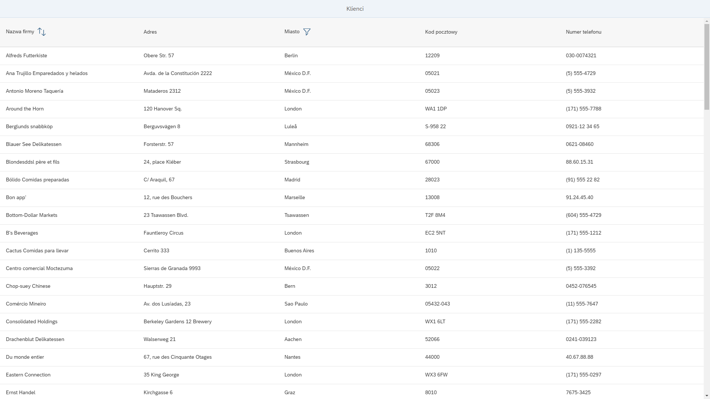

# TOYA JavaScript Developer 

This is a solution to the TOYA S.A. recruitment task

## Screenshot



## Links

- Solution URL: [CODE](https://github.com/cravsky/toya-homework)
- Live Site URL: [LIVE](https://toya-homework-production.up.railway.app/webapp/)
## Installation

### Prerequisites
- **Node.js**: [Download and install](https://nodejs.org/).

### Steps

1. **Download the repository**:  
   Go to the [repository page](https://github.com/cravsky/toya-homework), click on the green Code button, and select Download ZIP. Extract the downloaded ZIP file to your desired directory.

2. **Navigate to the project directory**:
   ```bash
   cd your-extracted-folder
   ```

3. **Install dependencies**:
   ```bash
   npm install
   ```

3. **Start the application**:
   ```bash
   npm run start
   ```

4. **Access the app**:  
   Open `http://localhost:8080/webapp/` in your browser.

### Troubleshooting
- Verify Node.js version:
   ```bash
   node -v
   ```
- Update Node.js if necessary.


